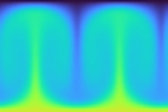

# Examples
Here we give videos of the control of domain-informed agents and compare to uninformed agents.
Note that all examples are typical representatives of the obtained flows. 

## Uncontrolled Rayleigh Bénard
|  Uncontrolled flow $Ra=10^4$                     |                Uncontrolled flow $Ra=10^5$|
|:-----------------------------------:|:-----------------------------------:|
|  |  |
|  **Uncontrolled flow** $Ra=10^6$                     |                **Uncontrolled flow** $Ra=5 * 10^5$|
|  |  |

## Experiment 1 and 2 (Flow control of RBC) Comparison of Domain-Informed Reinforcement Learning and Uninformed Reinforcement Learning
We show that the inclusion of domain knowledge lead to effcicient robust control of chaotic flows. On the left is the typical performance of a Domain-Informed agent on a random initial condition, and on the right is the typical performance of an uninformed agent. Althoug the both agents achieve a similar reduction of average convective heat transfer, note the large qualitative differences in the obtained flows for $Ra=10^4$ and $Ra=10^5$:

The uninformed agent typically exhibits destabalization effects for $Ra=10^4$ (see end of episode), whereas the domain-informed agent keeps the flow steady. For $Ra=10^5$, the domain-informed agent also achieves a stable steady flow, whereas the uninformed agent fails to merge cells and exhibits unsteady flow.

|  Domain-Informed                   |                Uninformed|
|:-----------------------------------:|:-----------------------------------:|
| $Ra=10^4$ | $Ra=10^4$ |
|  |  |
| $Ra=10^5$ | $Ra=10^5$ |
|  |  |
| $Ra=10^6$ | $Ra=10^6$ |
|  |  |

As can be seen, the domain-informed control is very successful in the regime $Ra=10^5$, where it transforms a flow that is originally chaotic in a steady flow with one Bénard cell. This behavior is consistent over different initial conditions and the achieved one-cell state remains stable.
For $Ra=10^6$, the RL agent fails to merge the cells, which probably is due to the extra noise so that the cell distance measurement becomes unreliable. However, we do have successful cell merging events for this case, but the subsequent Nusselt number reduction does not yield a steady flow. See the generalization experiment below where the agent successfully merges cells for $Ra=10^6$, but the subsequent flow remains unsteady. Hence, this regime is intrinsically chaotic.
The picture for $Ra=5*10^6$ is very similar to that of $Ra=10^6$, and is therefore omitted here.

## Experiment 3: Generalization to other flow regimes
Here we show how the agents (Domain-Informed and Uninformed) that were trained on a Rayleigh number of $Ra=10^5$ perform on higher and lower Rayleigh numbers.

|  Domain-Informed                    |               Uninformed|
|:-----------------------------------:|:-----------------------------------:|
| $Ra=10^4$ | $Ra=10^4$ |
|  |  |
| $Ra=10^6$ | $Ra=10^6$ |
|  |  |

